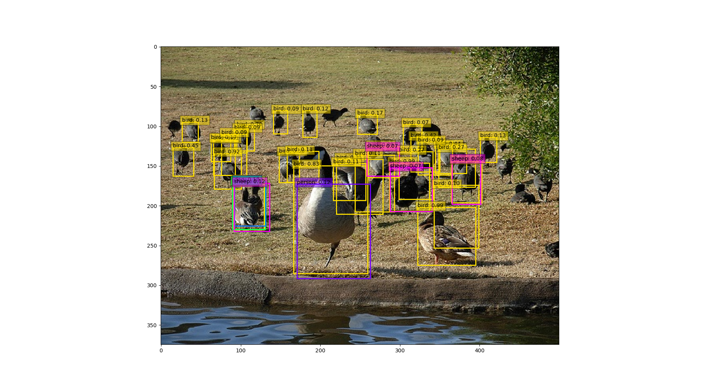
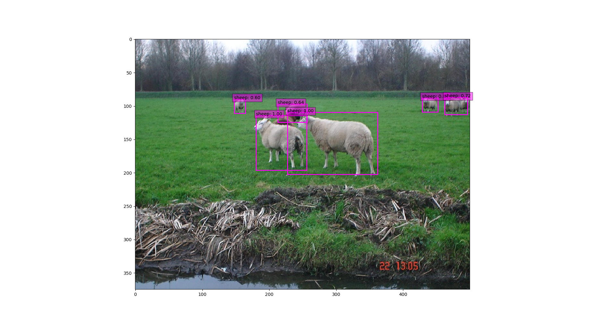
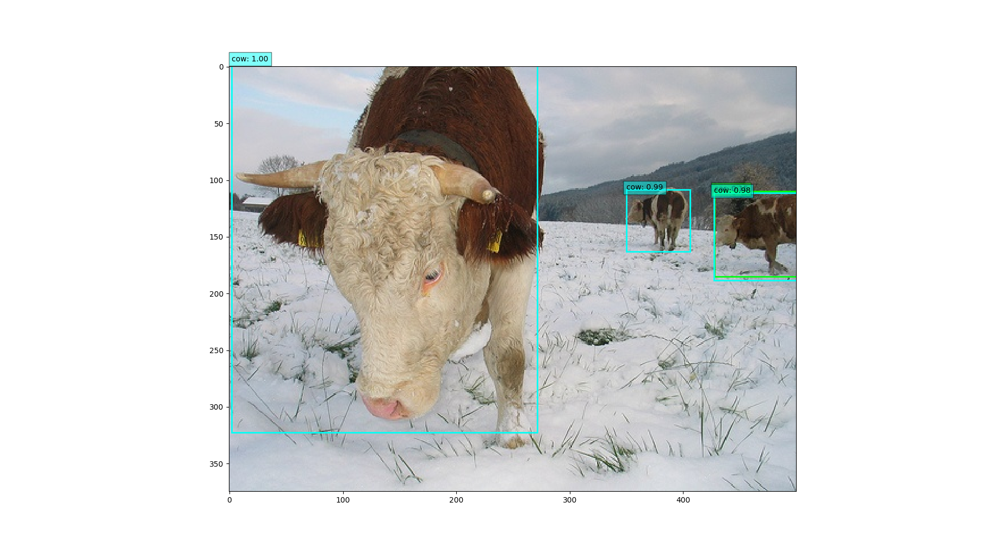
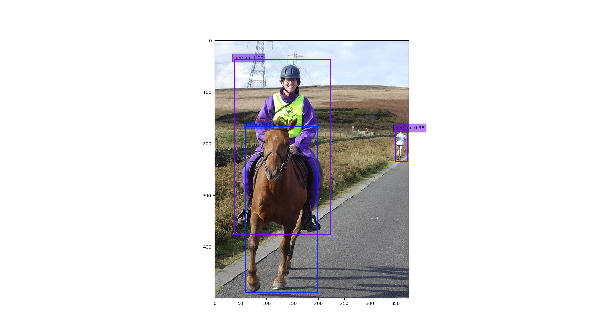
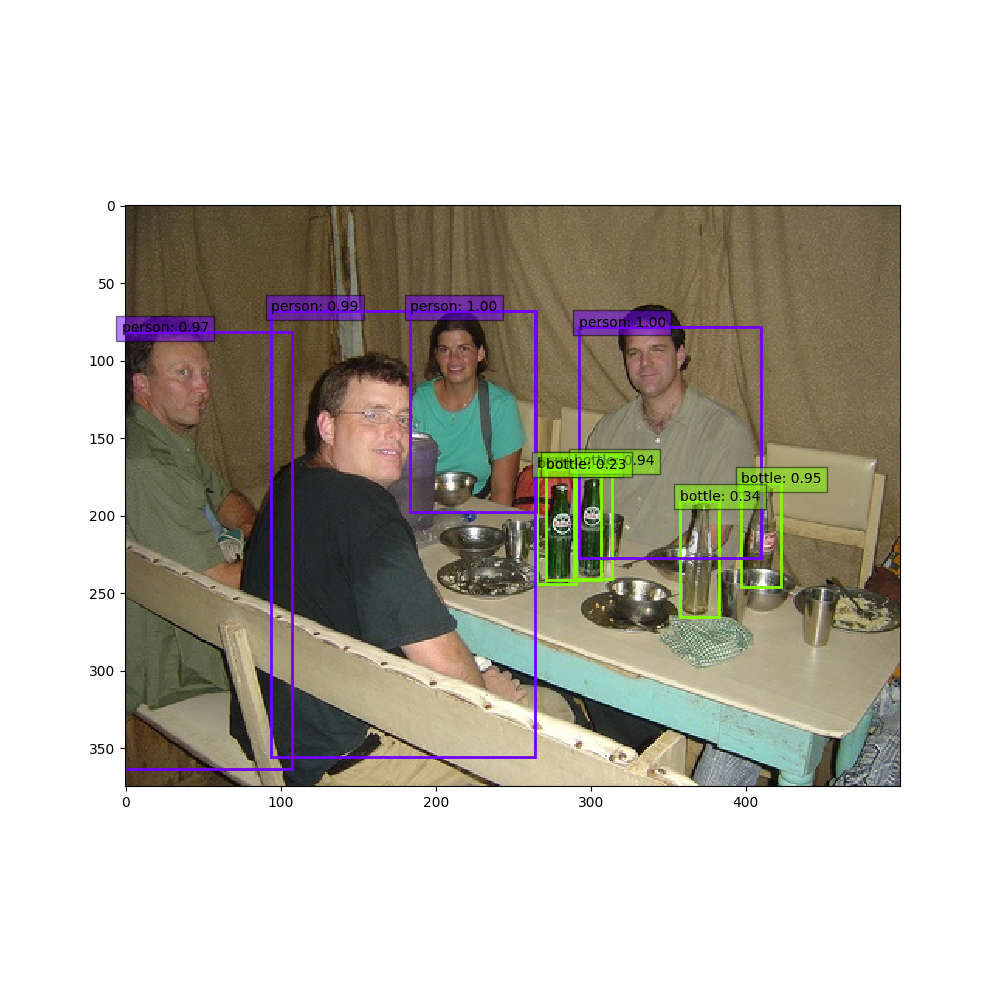
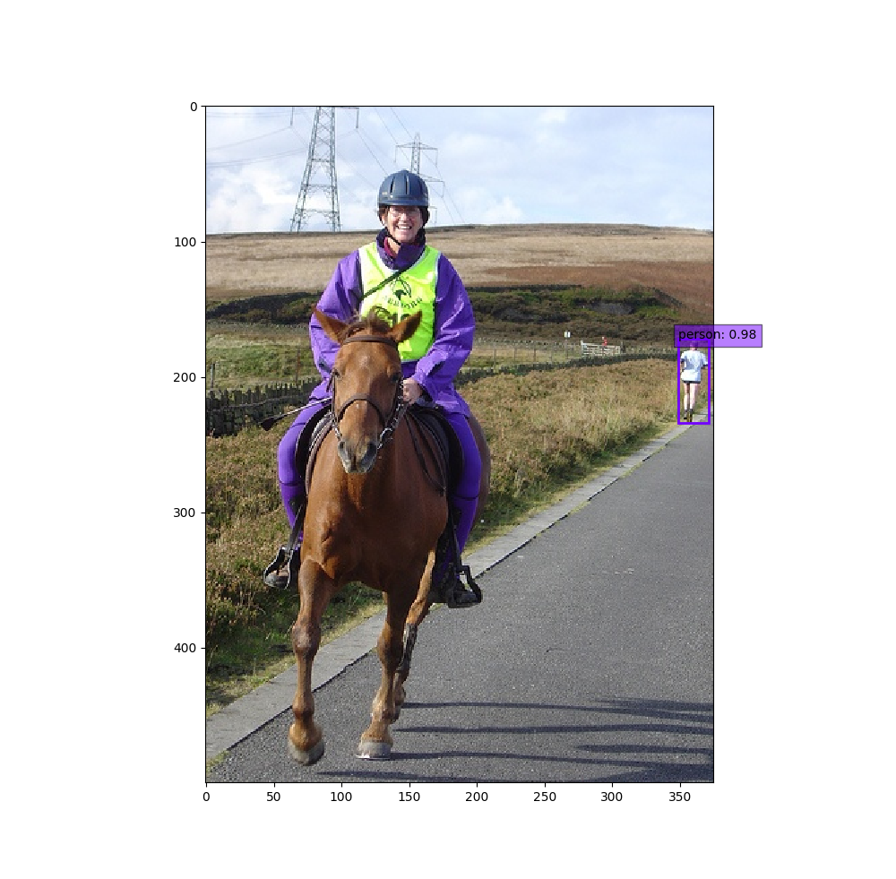
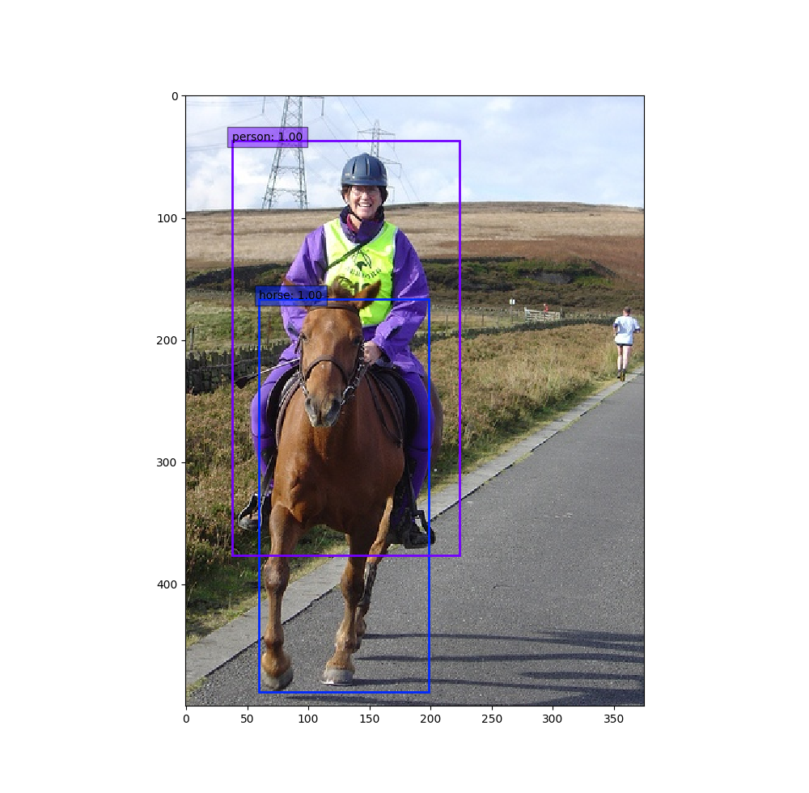
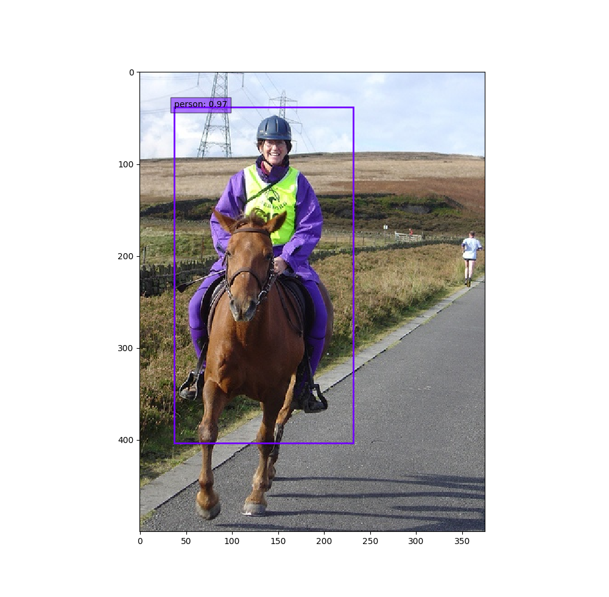

# multitrident
This is an object detection project. What I want to do is to let detector can detect objects of different scales through different branches, so I can detect and show detected objects of different scales in different detect heads. It dosen't need judge scale of objects and show them, because the different branches of network has learn what it small object、what is middle object and what is large object.
## network

## performance on voc0712
### img_size = 320*320

|class| aero | bike | bird | boat | bottle | bus | car|cat |chair | cow|table|dog|horse|mbike|person|plant|sheep|sofa|train|Tv|
| :------: | :------: | :------: | :------: | :------: | :------: | :------: | :------: | :------: | :------: | :------: | :------: | :------: | :------: | :------: | :------: | :------: | :------: | :------: | :------: | :------: |
| RefineDet AP | 83.9 | 85.4 | 81.4 | 75.5 | 60.2 | 86.4 | 88.1|89.1 |62.7 | 83.9|77.0|85.4|87.1|86.7|82.6|55.3|82.7|78.5|88.1|79.4|
| multitrident AP |84.5| 84.4 | 76.9 | 70.0 |63.7|85.0| 87.9|87.5|62.2 |80.4|67.7|83.4|87.4|85.2|81.6|50.9|80.9|76.0|84.6|77.4|

## demo
### all output

### only one branch output

all output

small object detect branch output

middle object detect branch output

large object detect branch output

